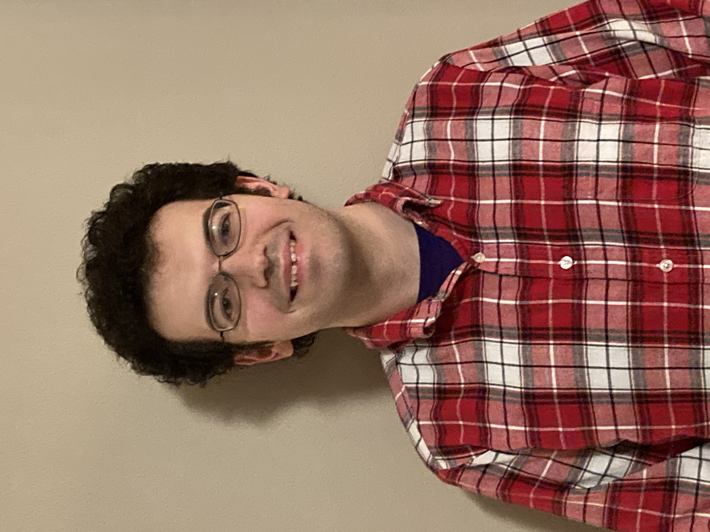
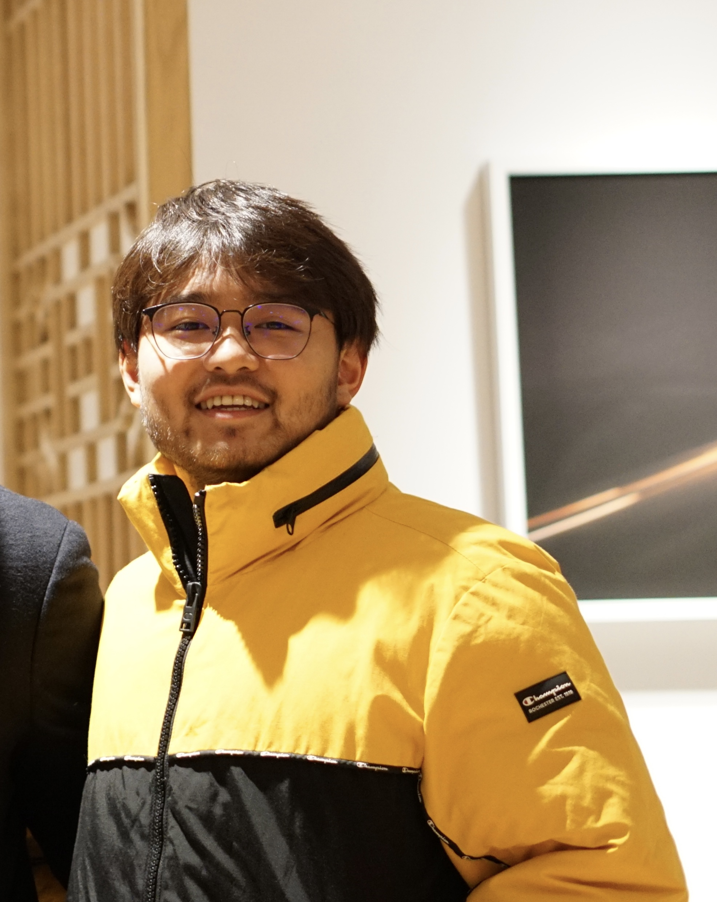
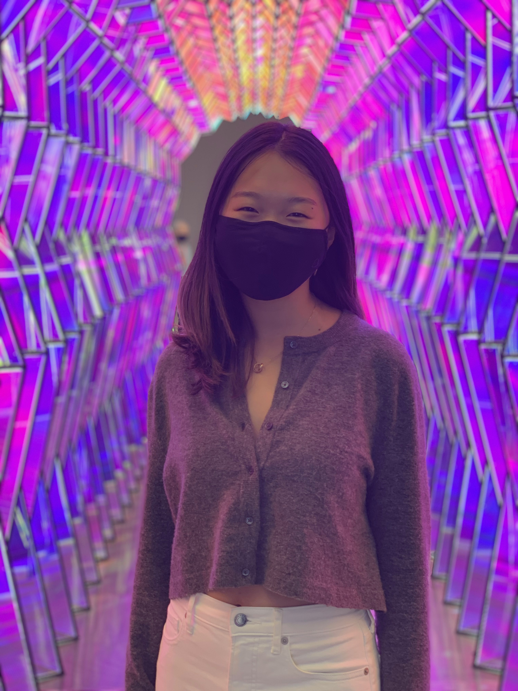

# Chia

 ## Project Overview
 
 We are reimagining a sustainable future of cryptocurrency and blockchain technology. We plan to build a DeFi product on top of Chia that leverages Chia's energy and time efficient consensus mechansism. 

# Links

[Team reading list @ notion] https://www.notion.so/Chia-Resources-Links-b72b01a400ab4b7a9344ba4552e01d70
 # :rocket: Latest Updates :rocket:

 
 # Team Members
Member |  Email | Photo
--- | --- | ---
Aaron Reed | aaron73@stanford.edu| 
Ende Shen |endeshen@stanford.edu | 
Finn Dayton | finniusd@stanford.edu | 
Jennifer He |jenhe@stanford.edu | 

# Team Skills Matrix

Name | Skills | Personal Traits | Desired Growth | Weakness
--- | --- | --- | --- | ---
Aaron | Python, C, C++, some Java; interest in crypto (I mine) | Creative, questioning, evidence-based | Working on a team, setting and executing goals, networking... and Solidity/Chialisp | Procrastination, time management, going off on tangents in discussions
Ende | Python, AI, some venture capital experience | love doing research | work with teammates, learn blackchain eco system | taking a step back and having more outreach
Finn | Python, Solidity, Javascript, general knowledge of crypto | hardworking | working on a team, time management, Solidity | procrasination 
Jennifer | Python, JavaScript, web dev, design, AI, very general knowledge of crypto | creative, analytical | working on a team, learning more about crypto and sustainability | procrastination, public speaking

# Team Communication

Slack: [*** to be decided ***]

Documentation on Google Drive available *** TBD *** [here](https://drive.google.com/drive/u/1/folders/0AAK6_efKZUj2Uk9PVA)

Notion: https://www.notion.so/Team-Home-ed2babbb88504af587e482fb26b0ff1d
